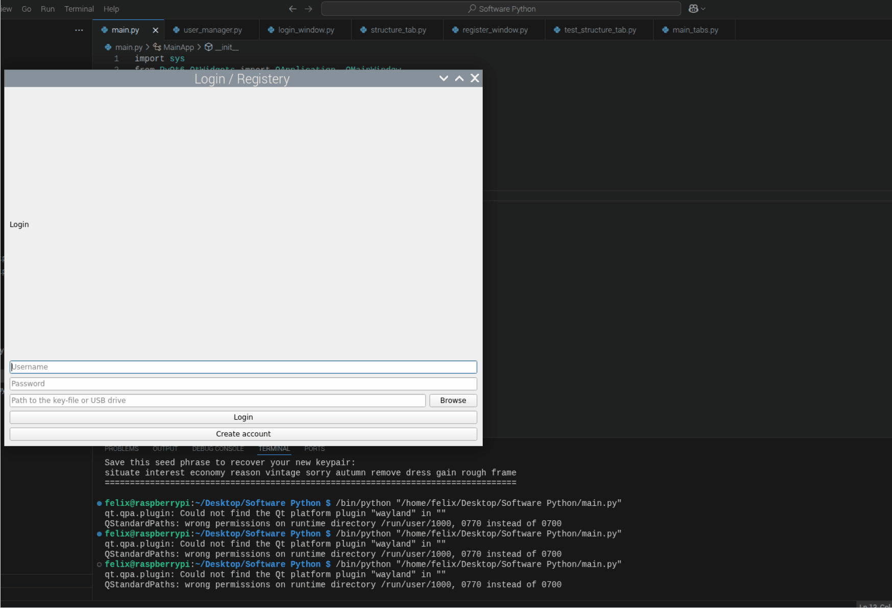

#  Technikerarbeit: DGUV-V3-Messgerät mit Solana-Anbindung

Ziel dieses Projekts ist die Entwicklung eines prototypischen DGUV-Messsystems auf Basis eines Raspberry Pi, das eine fälschungssichere, benutzerfreundliche und datenschutzkonforme Erfassung sowie Archivierung von Prüfdaten ermöglicht.  
Die zentrale Anforderung besteht in der unveränderlichen Speicherung aller Messergebnisse auf der Solana-Blockchain, wodurch eine nachträgliche Manipulation ausgeschlossen wird und die Prüfdaten langfristig nachvollziehbar bleiben.
Die Bedienung erfolgt über eine grafische Benutzeroberfläche, die lokal auf dem Raspberry Pi läuft und sowohl die strukturierte Erstellung der Prüfumgebung als auch die Durchführung und Protokollierung der Messungen unterstützt.  
Nach Abschluss der Messungen wird ein PDF-Protokoll generiert, das die relevanten Prüfdaten enthält und anschließend verschlüsselt über ArDrive gespeichert wird. Der Zugriff auf diese Protokolle ist ausschließlich autorisierten Nutzern vorbehalten.  

---

##  Status & Updates

### Nächstes update: **Verschlüsselung der kundendaten in ardrive **

### Update – 24.08.2025

In diesem Update habe ich das Dashboard weiter überarbeitet. Es werden nun mehr Informationen zur Wallet angezeigt, darunter der aktuelle Preis von SOL und AR in USD und EUR sowie der Kontostand in beiden Währungen. Zusätzlich habe ich eine Hochrechnung der durchschnittlichen Transaktionsgebühren integriert, die in einer Settings-Datei auf dem Prüfer-Stick gespeichert wird. Dadurch sind beim Login sofort Werte sichtbar, ohne dass jedes Mal aufwendig die CoinGecko-API abgefragt werden muss. Der Kontostand wird alle 120 Sekunden über die CLI ermittelt, die Fees werden über die Solana- und Arweave-API abgefragt, während die Preise von der CoinGecko-API stammen.

Ebenfalls hinzugekommen ist ein Knopf zum Erstellen eines Ordners in ArDrive. Zwar dauert es etwa 20 bis 30 Minuten, bis die Transaktion endgültig bestätigt ist, jedoch erhalten wir unmittelbar eine Folder-ID, die später für die Start- und End-Memos genutzt wird. Da die verschlüsselten Memos durch die X25519-Multiverschlüsselung rund 1200 Bytes groß werden und damit die Größenbegrenzung von Solana überschreiten, erfolgt der Upload bereits bei der Start-Memo in ArDrive. Dort wird eine JSON-Datei mit den verschlüsselten Informationen hinterlegt, die beim Anlegen einer neuen Maschine im Maschinenmanager erzeugt wird.

Zusätzlich habe ich den Maschinenmanager programmiert. Er legt auf dem Prüfer-Stick eine JSON-Datei an, in der Maschinen samt Kundennummern gespeichert sind. Beim Messen kann der Prüfer anschließend die passende Maschine auswählen. Die Start-Memo wird verschlüsselt nach ArDrive hochgeladen, da Solana hierfür nicht ausreicht. Alternativen wie IPFS oder Ethereum habe ich zwar in Betracht gezogen, für die Umsetzung genügt jedoch Arweave beziehungsweise ArDrive, da ich deren CLI bereits kenne. Aktuell arbeite ich daran, den Upload der Start-Memo in den Ablauf einzubinden. Denkbar ist, dass der Upload erst erfolgt, wenn der Prüfer im Structure-Editor die Struktur fertiggestellt hat. Auf diese Weise könnten Kundendaten und Struktur gemeinsam hochgeladen werden, was Transaktionsgebühren spart. Da die leere Struktur von weiteren Prüfern wiederverwendet werden soll, wird sie unverschlüsselt hochgeladen, was unproblematisch ist, da es sich nur um Rohdaten und BMK-Bezeichnungen handelt.

Nach Abschluss der Messungen wird im Readings-Tab ausgewählt, welche Messungen tatsächlich eingeloggt werden, da versehentlich gespeicherte oder fehlerhafte Werte nicht dauerhaft in Solana landen sollen. Aus der Auswahl wird eine JSON erstellt, die als Abschluss-Memo in ArDrive hochgeladen wird. Der entsprechende Link wird anschließend als End-Memo in Solana an die Maschinen-Wallet übermittelt. Damit erkennt die Prüfersoftware, dass eine Maschine beziehungsweise Wallet abgeschlossen ist, und verhindert weitere Transaktionen. Manuell könnten zwar immer noch Transaktionen gesendet werden, doch die Software blockiert dies im GUI, was in der Praxis ausreichend ist.

Darüber hinaus habe ich bereits eine erste Version der Clientsoftware erstellt. Sie ist noch nicht einsatzbereit, liefert aber bereits die Public Keys des Kunden sowie von zwei Backup-Admin-Accounts, sodass im Verlustfall eine doppelte Absicherung besteht. Die Clientsoftware soll später die klassischen PDF-Protokolle ersetzen und dem Kunden direkten Einblick in die Blockchain-Daten geben. Dazu kopiert er den ArDrive-Link in die Software, lädt die verschlüsselten Dateien herunter und entschlüsselt sie mit seinen Private Keys. Die Daten werden mit den Hashes der Blockchain verglichen, um ihre Integrität sicherzustellen. Da sie ohnehin verschlüsselt sind, würde jede Manipulation sofort auffallen und die Daten unbrauchbar machen. Statt eines manipulierbaren PDF-Protokolls entsteht so eine Live-Ansicht der Blockchain-Daten, die bei jedem Zugriff erneut mit den Blockchain-Hashes abgeglichen wird. Als nächsten Schritt plane ich, den Upload der verschlüsselten Daten in ArDrive je nach Ablauf direkt beim Erstellen einer Maschine oder alternativ erst später vorzunehmen.

### Update – 17.08.2025 
Dashboard hinzugefügt. Zur Aufladung der Prüfer-Wallets und für eine bessere Übersicht wurde nun ein Dashboard implementiert. Es generiert QR-Codes, die die öffentlichen Adressen der Wallets enthalten, sodass problemlos über eine mobile Wallet oder direkt über Börsen-Apps wie Binance, Coinbase, Kraken etc. Kryptowährungen an die Prüfer-Wallets gesendet werden können.

### Update – 16.08.2025
Zur besseren Bedienung und Benutzerfreundlichkeit habe ich ein Fenster hinzugefügt, das den Status des Generierungsprozesses in Form eines Fortschrittsbalkens anzeigt. Darin werden die einzelnen Schritte – Beginn der Generierung, Solana-Wallet-Generierung, Solana-Wallet erstellt, Beginn der Arweave-Wallet-Generierung und Arweave-Wallet erstellt – dargestellt, um dem Benutzer zu verdeutlichen, dass der Prozess bereits läuft und er bitte warten soll.

### Update – 11.08.2025
Die ArWeave-Privatekeys werden nun ebenfalls in der `.user.json` gespeichert und mit dem Benutzernamen sowie Passwort vertschlüsselt. Da die ArWeave-CLI die Eingabe selbstgewählter BIP-32-Seedphrasen erfordert, habe ich eine Zufallsgenerierung eingebaut, die die Seeds erstellt. Die Seeds sind dabei unwichtig, da sie ohnehin verschlüsselt auf dem USB-Stick gespeichert werden und daher nicht separat aufgeschrieben werden müssen.

### Update – 10.08.2025

Heute habe ich die beiden Tabs **Login** und **Registrierung** fertiggestellt.  
Diese erscheinen nach dem Start der Software.  

- **Login:** Benutzer meldet sich mit **Benutzername**, **Passwort** und **Key-Datei** vom USB-Stick an.  
  Das Passwort wird mit **bcrypt** validiert, anschließend wird die Wallet mit **AES-256** entschlüsselt.  
- **Registrierung:** Erstellt einen neuen Account mit Benutzername/Passwort und generiert dabei eine echte **Solana-Wallet** via CLI.  
  Die privaten Schlüssel werden AES-verschlüsselt in der Datei `.user.json` auf dem Stick gespeichert.  

Damit ist es möglich, nach erfolgreichem Login Transaktionen auf der automatisch erzeugten Prüfer-Wallet durchzuführen.  
Die Wallet-Erstellung erfolgt plattformübergreifend (Raspberry Pi & Windows/WSL).

---

##  Installation 

---

